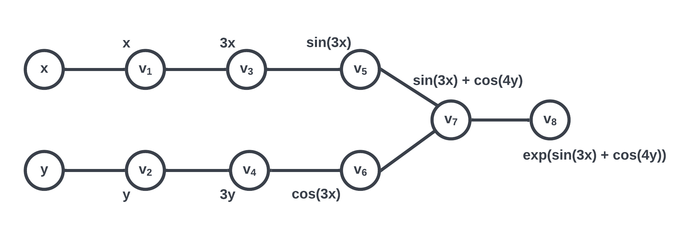
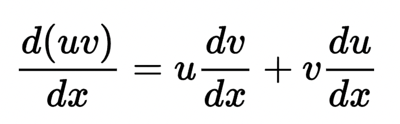
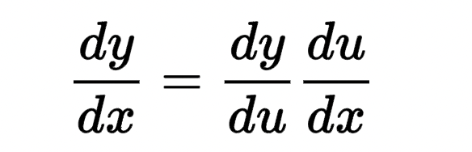

# Doc

## Introduction

Automatic Differentiation (AD) is to solve for the derivative of a function at a given point of estimate. It utilizes the concept of dual number to achieve an accuracy better than numeric differentiation. It is also more efficient than symbolic differentiation.

## Background

In the most general case, a function can have more than one coordinate. To evaluate this function, we would take the sum of the partial derivatives with respect to each said coordinate. To illustrate, consider function $f(u(t), v(t))$; we first apply the chain rule to for each piece, we get:
$$\frac{df}{dt} = \frac{\partial f}{\partial u} \frac{du}{dt} + \frac{\partial f}{\partial v} \frac{dv}{dt}$$

At a lower level, the implementation of AD requires breaking down the original function into smaller pieces known as elementary functions. For instance, consider function
$$f(x, y) = exp(sin(3x) + cos(4y))$$
Then these would be its elementary functions:
$$g(z) = 3z$$
$$g(z) = 4y$$
$$g(z) = sin(z)$$
$$g(z) = cos(z)$$
$$g(z) = exp(z)$$
Furthermore, the order of evaluating these elementary functions can be organized into a computational graph:



Note the subsequent nodes named $v_i$; these store the intermediate results of evaluating each elementary function. After evaluating each $v_i$, we get a sequence from $v_1$ to $v_8$; this is called the primal trace. Similarly, following the computational graph, if we instead evaluate the derivative at each step, the resulting sequence would be called the dual trace. Such is essentially the procedure of automatic differentiation, specifically the forward mode, which we plan to implement. Note that there exists a counterpart named reverse mode; we will not describe it here.

## How to use TEAM20AD

Given that this package will be distributed  with pyPI, the user will first need to install the package.

`python -m pip install TEAM20AD`

They would need to import all the dependable packages, namely numpy, scipy, pandas, and matplotlib.

When it’s time to use the package, they will import by:

`from TEAM20AD import ad`

User will be able to instantiate the AD objects as follows:

```python
f = some_function
x = some_value
Ad = ad()
res = ad.forward(f, x)
```

## Software Organization

For now at this phase of the project, our directory structure will be as follows (tentative):

```
team20/
docs
milestone1
	(other milestones)
LICENSE
README.md
untitled.yml
ad
	test
		test.py
	src
		__init__.py
		__main__.py
		adfun.py
		api.py
		utils.py
```

As our team continues with the development, we expect the directory structure to change accordingly.

Considering that the whole scheme of auto differentiating will rely heavily on mathematical computations, we will use numpy, scipy, pandas, and math for calculations, along with matplotlib for graphics.

We plan on keeping track of the test suites by having all the tests in the ./test directory.

As of now, we plan to distribute the package using PyPI following PEP517/PEP518.


## Implementation


The first class we need and that will implement first - at least at the naive conceptual level - is the TAD class that will serve as the first user instantiated object in calculating the auto differentiation. We will then implement the utility class Util that will have overwritten methods for all the primitive arithmetic along with sin/cos computation. Dual numbers will be an object of itself containing the necessary components.

As for the name attributes and methods for classes, we tentatively plan to have the following:

- TAD:
	- Name Attribute: values, derivatives, shape
	- Methods: constructor (__init__), __add__, __sub__, __mul__, __div__
- Util:
	- For util methods, we will update as necessary.
- Graph:
	- We expect to need and implement a graph class to resemble the computational graph in forward mode.
	- Method: graph
- Calculate:
	- Here’s a separate calculate class for basic operator overloading:
	- Methods: cos(tad), sin(tad), tan(tad), sqrt(tad), exp(tad), log(tad, b)

As for the handling of $f: \mathbb{R}^m -> \mathbb{R}$ and $f: \mathbb{R}^m -> \mathbb{R}^n$, we will have a high-level function object in form of vectors to compute the Jacobian.

We will need to depend on the libraries mentioned above, namely numpy, scipy, and matplotlib.


## Feedback

### Milestone 1

#### Introduction(2/2):
- Would be great to write more in the intro. Elaborate on issues that exist with other techniques and the applications AD is useful for.

Differentiation, the process of finding a derivative, is one of the most fundamental operations in mathematics. It measures the rate of change of a function with respect to a variable. Computational techniques of calculating differentiations have broad applications in many fileds including science and engineering which used in finding a numerical solution of ordinary differential equations, optimization and solution of linear systems. Besides, they also have many real-life applications, like edge detection in image processing and safety tests of cars.

There are three popular ways to calculate the derivative:
	1. Numerical Differentiation: Finite Difference
	2. Symbolic Differentiation
	3. Automatic Differentiation

Symbolic Differentiation and Finite Difference are two ways to numerically compute derivatives. Symbolic Differentiation is precise, but it can lead to inefficient code and can be costly to evaluate. Finite Difference is quick and easy to implement, but it can create round-off error, the loss of precision due to computer rounding of decimal quantities, and truncation error, the difference between the exact solution of the original differential equation.

Automatic Differentiation is more efficient than two of other methods mentioned prior. While it utilizes the concept of dual number, it achieves machine precision without costly evaluation, and therefore is widely used.

#### Background(2/2):
- Make sure to use the latex format correctly.
- idea of using an example to explain the introduction is nice but you need to elaborate/explain more Chain Rule, seed vectors, evaluation of forward trace, and how all these help in computing the derivatives. You should also make sure to be explicit about how the dual numbers will be useful (showing an example of the use of dual numbers for AD will help a lot).

1. Basic Calculus

   * Product Rule

     Product rule is a formula used to find the derivatives of products of two or more functions. The product rule can be expressed as

     

   * Chain Rule

     Chain rule is a formula to compute the derivative of a composite function. The chain rule can be expressed as

	

2. Automatic Differentiation

   * Automatic Differentiation refers to a general way of taking a program which computes a value, and automatically constructing a procedure for computing derivatives of that value. The derivatives sought may be first order (the gradient of a target function, or the Jacobian of a set of constraints), higher order (Hessian times direction vector or a truncated Taylor series), or nested. There are two modes in Automatic Differentiation: the forward mode and reverse mode.

   * Elementary functions: The set of elementary functions has to be given and can, in principle, consist of arbitrary functions as long as these are sufficiently often differentiable. All elementary functions will be implemented in the system together with their gradients.

   * Evaluation Trace of a Function: All numeric evaluations are sequences of elementary operations. The evaluation of f at some point x = (x1, ..., xn) can be described by a so-called evaluation trace v[0] = v[0](x), ..., v[μ] = v[μ](x), where each intermediate results v_j are functions that depend on the independent variables x. 

3. Forward Mode

   * Forward automatic differentiation divides the expression into a sequence of differentiable elementary operations. The chain rule and well-known differentiation rules are then applied to each elementary operation.

   * Forward automatic differentiation computes a tangent trace of their directional derivatives D_pv_j at the same time as it performs a forward evaluation trace of the elementary pieces of a complicated f(x) from the inside out. 


#### How to use(3/3):
Please do not submit versions that are not proofread. Pay attention to typos. Is not acceptable to have typos on the "import statement". Would be great to explain more about how the user can import the dependent packages.

Given that this package will be distributed  with pyPI, the user will first need to install the package.

`python -m pip install TEAM20AD`

They would need to import all the dependable packages, namely numpy, scipy, pandas, and matplotlib.

When it’s time to use the package, they will import by:

`import TEAM20AD as tad`

User will be able to instantiate the AD objects as follows:

```python
f = some_function
x = some_value
Ad = tad()
res = tad.forward(f, x)
```

#### Software Organization(2/2):
    - Also, use the tree to have a better visual for the directory structure.
    - you should talk about the package distribution, the tests and where they will be located.
    - You should mention the modules and what their functionality will be.

##### Package Installation

Eventually, we will upload the package to <https://pypi.org>. Assuming we will name our package `TEAM20AD`, this is how one can install it and test it in a virtual environment (user should have anaconda installed on their machine):

``` python
# clone repo
git clone https://code.harvard.edu/CS107/team20.git
# get into directory
cd TEAM20AD
# create virtual environment
conda create -p ./conda-env python=3.9
# activate virtual environment
conda activate ./conda-env
# install dependencies
pip install -r requirements.txt
# test
pytest tests/
```

The last command will then run all tests cases located in folder named `ad/tests/` with `pytest`.

##### Modules

There will be two main modules `Forward` and `Reverse` each implementing the corresponding modes in AD.


#### Implementation(3/4):
You need to elaborate more on the core data structure, the methods, and how you will overload the elementary operations. You should also mention what each class will do in more detail and possibly give an example. Elementary functions are another big topic you can write more about. You should talk more about the dual numbers and the reverse functions (e.g. radd). You should explain what each class will be doing and how. Big emphasis on how exactly you will implement it.


#### License(0/2):
Please add the license and the reason for using those.


